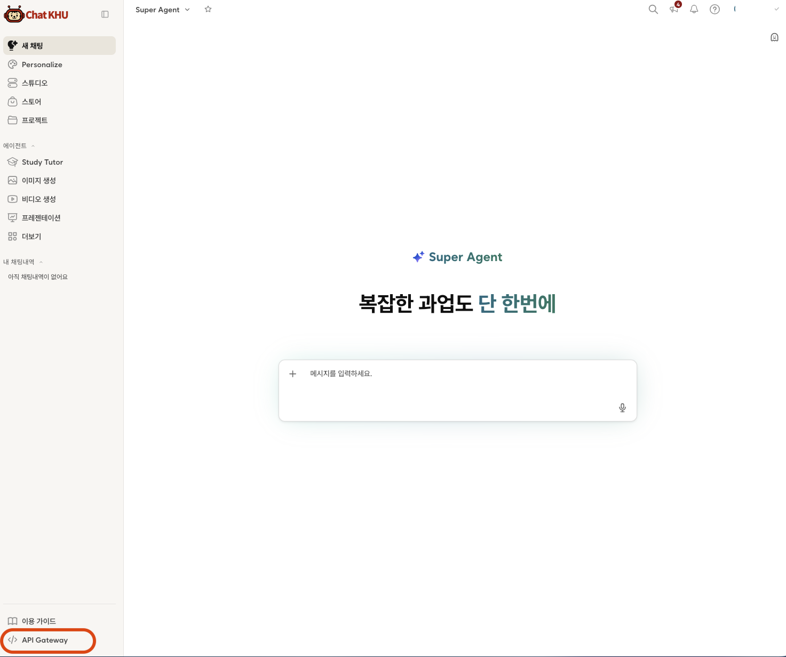
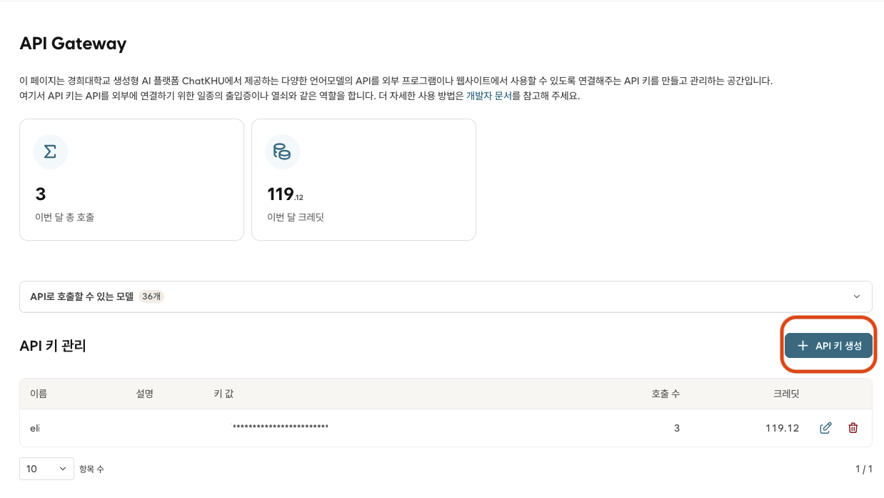
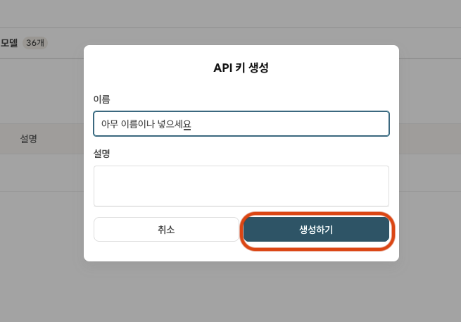
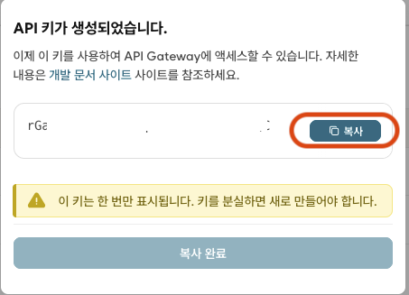

# MM_LLM

경희대학교 의료경영학과(Medical MBA) 학생을 위한 ChatKHU 데스크톱 AI 워크스페이스입니다. 학생 본인의 API 키 하나로 대화부터 이미지·오디오·비디오 생성까지 사용할 수 있습니다.

## 주요 기능

- ChatKHU Gateway가 제공하는 36개 채팅 모델과 추가 모델을 실시간으로 불러와 선택
- 이미지 생성, 음성 합성·받아쓰기·음악, 비디오 생성
- PDF·DOCX·XLSX·이미지 첨부와 문서 내용 기반 대화
- 병원 경영, 의료 정책, 논문 읽기, 연구 설계 시작 템플릿
- 운영체제 보안 저장소를 이용한 API 키 보호와 자동 로그인
- 기기 내부에 암호화해 보관하는 대화 기록
- 남은 크레딧 자동 갱신과 GitHub Releases 기반 앱 자동 업데이트
- macOS Intel·Apple Silicon 및 Windows 지원

## 개인정보 안내

파일을 처음 첨부할 때 환자 식별정보나 개인정보를 제거했는지 대화별로 한 번 확인합니다. 앱이 개인정보를 자동으로 탐지하거나 제거하지 않으므로 사용자가 전송 전에 직접 확인해야 합니다. 일반 텍스트 질문은 바로 전송됩니다.

## 설치

배포 버전은 [GitHub Releases](https://github.com/airkjw/MM_LLM/releases)에서 받을 수 있습니다.

- Apple Silicon Mac: `arm64.dmg`
- Intel Mac: `x64` 또는 기본 `.dmg`
- Windows: `x64-Setup.exe`

## ChatKHU API 키 발급 방법

1. [ChatKHU 로그인 페이지](https://chat.khu.ac.kr/auth)에 접속해 Info21 아이디와 비밀번호로 로그인합니다.

2. 로그인 후 왼쪽 아래의 **API Gateway**를 클릭합니다.

   

3. API 키 관리 화면에서 **+ API 키 생성**을 누릅니다.

   

4. API 이름을 입력하고 **생성하기**를 누릅니다. 설명은 필요할 때 입력하면 됩니다.

   

5. API 키가 생성되면 **복사**를 눌러 메모장 등 안전한 곳에 보관합니다. 이 키는 한 번만 표시되며, 잃어버리면 새로 만들어야 합니다. 복사한 API 키가 MM_LLM의 로그인 키가 됩니다.

   

## 개발

Node.js 24 이상이 필요합니다.

```bash
npm ci
npm run dev
npm test
npm run build
```

서명, 공증, 패키징과 Release 자동화는 [배포 안내](docs/RELEASE.md)를 참고하세요.

## API

MM_LLM은 [ChatKHU Gateway API](https://docs.mindlogic.ai/docs/khu/api-gateway/getting-started/introduction)를 사용합니다. 앱에서 입력한 API 키는 소스 코드나 GitHub로 전송·저장하지 않습니다.
