# MM_LLM

경희대학교 의료경영학과(Medical MBA) 학생을 위한 ChatKHU 데스크톱 AI 워크스페이스입니다. 학생 본인의 API 키 하나로 대화부터 이미지·오디오·비디오 생성까지 사용할 수 있습니다.

## 주요 기능

- ChatKHU Gateway가 현재 계정에 허용한 채팅·미디어 모델을 실시간으로 불러와 선택
- Gemini·Sonar의 직접 웹 검색과 그 밖의 모델을 위한 Sonar 검색 연동
- 이미지 생성, 음성 합성·받아쓰기·음악, 비디오 생성
- PDF·DOCX·XLSX·PPTX·HWPX·TXT·MD·CSV·이미지 첨부와 문서 내용 기반 대화
  (PPTX의 수식·SmartArt·차트 안 글자와 구형 HWP·DOC·XLS·PPT는 아직 읽지 않습니다)
- 병원 경영, 의료 정책, 논문 읽기, 연구 설계 시작 템플릿
- 운영체제 보안 저장소를 이용한 API 키 보호와 자동 로그인
- 기기 내부에 암호화해 보관하는 대화 기록
- 남은 크레딧 자동 갱신과 GitHub Releases 기반 앱 자동 업데이트
- macOS Intel·Apple Silicon 및 Windows 지원

## 화면 안내

아래 화면은 실제 API 키 없이 모의 데이터로 실행한 앱 화면입니다. 크레딧 숫자와 대화·프로젝트 이름은 예시입니다.

왼쪽 끝의 **세로 막대**에서 대화, 모델 비교, 논문·법령 리서치, 미디어, 음성, 프로젝트, 챗봇을 오갑니다. 맨 아래 톱니바퀴는 앱 설정, 그 아래 사람 아이콘은 계정·API 키 설정입니다. 각 화면의 위쪽 검색 칸이나 `Ctrl+K`(Mac은 `⌘K`)로 대화를 찾고 명령을 실행할 수 있습니다.

### 로그인

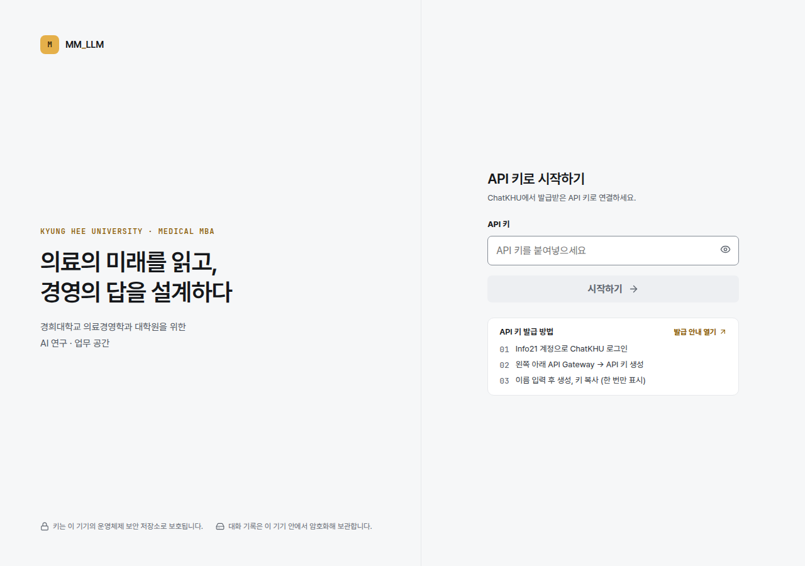

발급받은 API 키를 붙여 넣으면 시작합니다. 키는 이 기기의 운영체제 보안 저장소로 보호되고, 대화 기록은 기기 안에서 암호화되어 보관됩니다.

### 대화

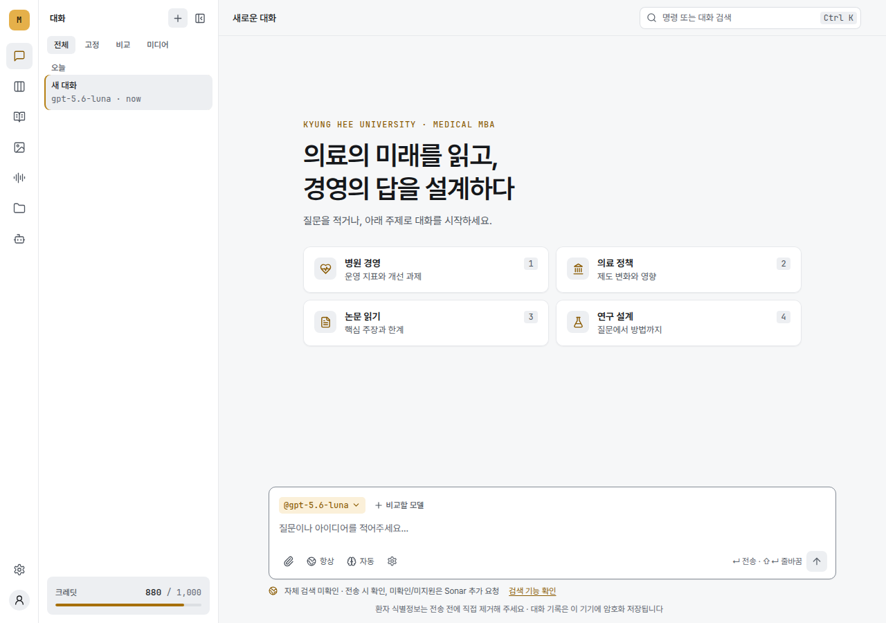

새 대화에서 병원 경영·의료 정책·논문 읽기·연구 설계 카드를 누르거나 키보드 `1`–`4`로 시작할 수 있습니다. 입력창 위의 모델 칩으로 대화 모델을 바꾸고, 아래 줄에서 웹 검색과 사고 강도를 고릅니다.

### 모델 선택과 비교

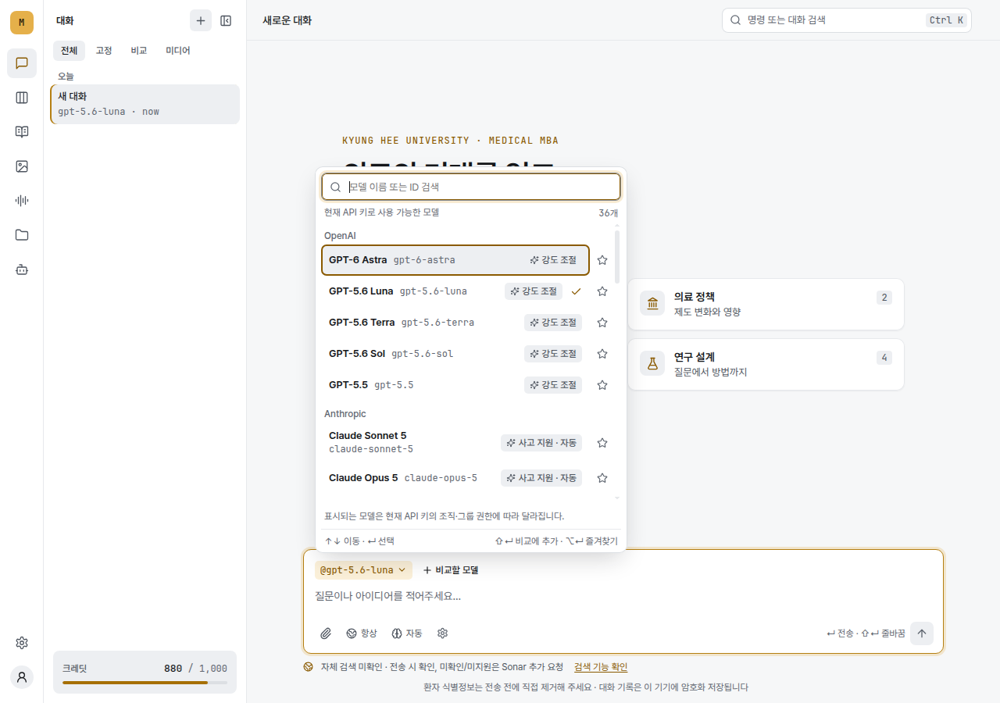

`+ 비교할 모델`을 눌러 모델을 고르고 `Shift+Enter`로 비교 목록에 최대 3개까지 담습니다. `Alt+Enter`(Mac은 `⌥↵`)나 줄마다 있는 별 버튼으로 즐겨찾기를 지정합니다.

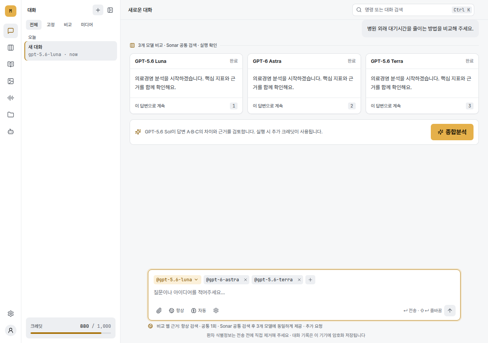

질문을 보내면 모델별 답변이 나란히 나타납니다. 좁은 창에서는 세로로 쌓입니다. 마음에 드는 답변에서 **이 답변으로 계속**을 누르거나 키보드 `1`–`3`으로 그 모델과 대화를 이어 갑니다. 종합분석은 추가 크레딧이 사용되므로 안내 문구를 확인한 뒤 누릅니다.

### 미디어

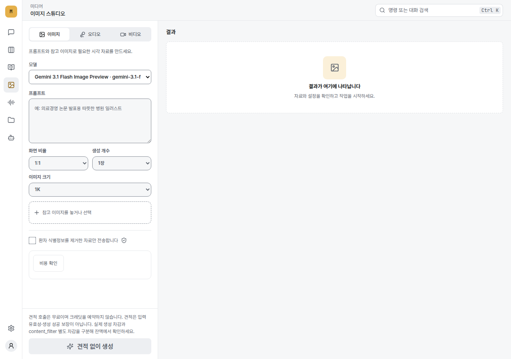

이미지·오디오·비디오를 위쪽 탭으로 바꿉니다. 비용 확인으로 예상 크레딧을 본 뒤 생성할 수 있고, 첨부 자료는 환자 식별정보를 제거했다고 확인해야 전송됩니다.

### 프로젝트

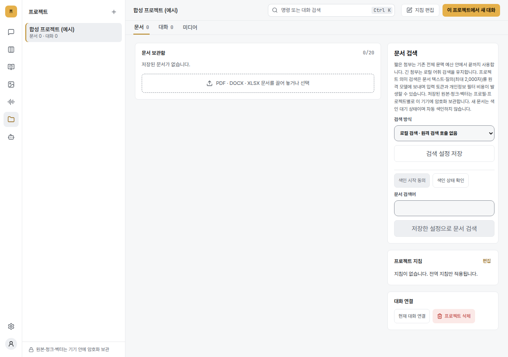

연구별 지침과 문서를 묶어 두고 그 프로젝트에서 새 대화를 시작합니다. 문서는 기기 안에 암호화해 보관하며, 색인과 원격 검색은 동의한 뒤에만 실행됩니다.

### 설정

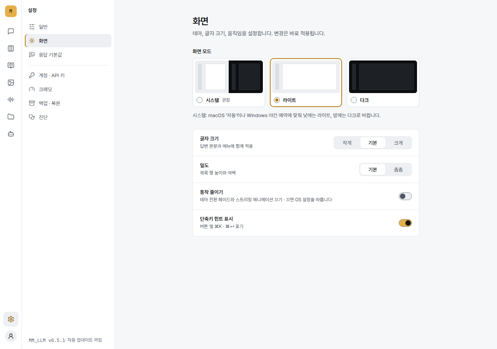

화면 모드(시스템·라이트·다크), 글자 크기(작게·기본·크게), 밀도, 동작 줄이기와 단축키 힌트는 고르는 즉시 적용되고 저장됩니다. 같은 화면에서 기본 지침, 계정·API 키, 크레딧, 백업·복원, 진단 정보도 관리하며, 아래쪽에서 앱 버전과 업데이트 상태를 확인합니다.

## 개인정보 안내

파일을 처음 첨부할 때 환자 식별정보나 개인정보를 제거했는지 대화별로 한 번 확인합니다. 앱이 개인정보를 자동으로 탐지하거나 제거하지 않으므로 사용자가 전송 전에 직접 확인해야 합니다. 일반 텍스트 질문은 바로 전송됩니다.

## 설치

배포 버전은 [GitHub Releases](https://github.com/airkjw/MM_LLM/releases)에서 받을 수 있습니다.

- Apple Silicon Mac: `arm64.dmg`
- Intel Mac: `x64` 또는 기본 `.dmg`
- Windows: `x64-Setup.exe`

## ChatKHU API 키 발급 방법

1. [ChatKHU 로그인 페이지](https://chat.khu.ac.kr/auth)에 접속해 Info21 아이디와 비밀번호로 로그인합니다.

2. 로그인 후 왼쪽 아래의 **API Gateway**를 클릭합니다.

   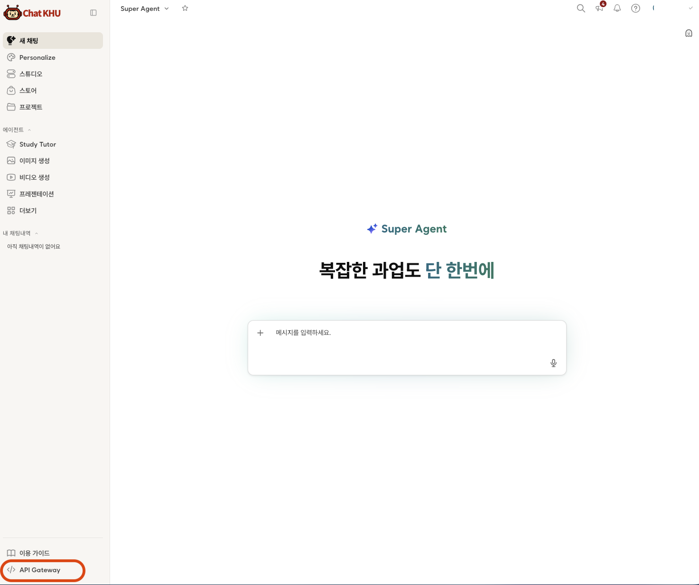

3. API 키 관리 화면에서 **+ API 키 생성**을 누릅니다.

   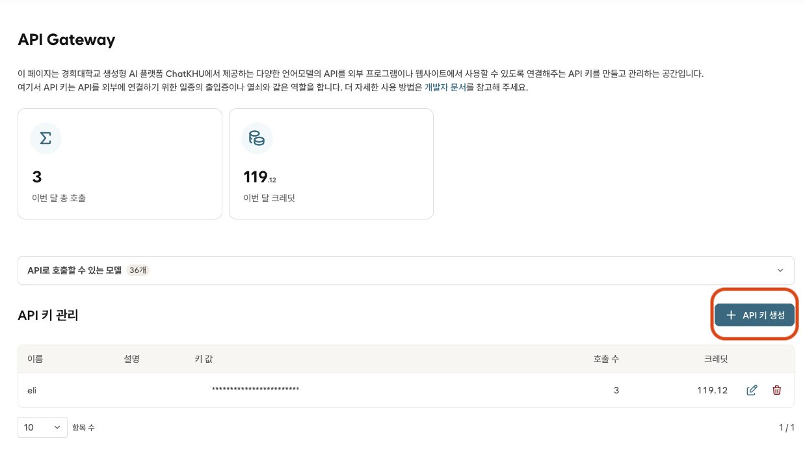

4. API 이름을 입력하고 **생성하기**를 누릅니다. 설명은 필요할 때 입력하면 됩니다.

   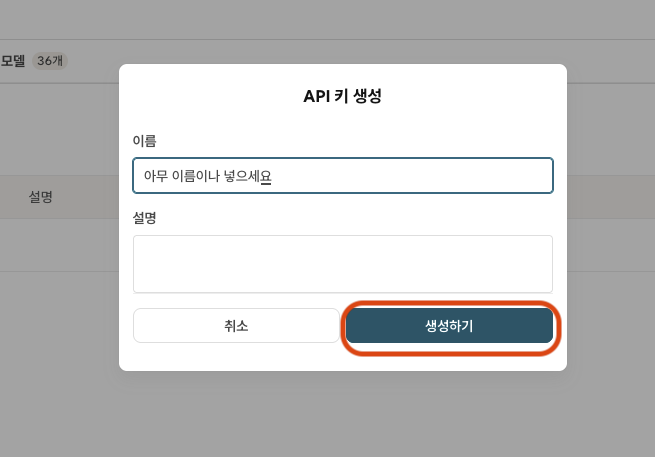

5. API 키가 생성되면 **복사**를 눌러 메모장 등 안전한 곳에 보관합니다. 이 키는 한 번만 표시되며, 잃어버리면 새로 만들어야 합니다. 복사한 API 키가 MM_LLM의 로그인 키가 됩니다.

   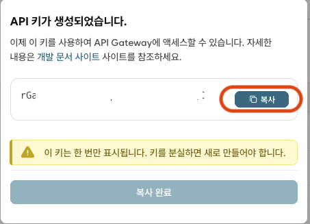

## 개발

Node.js 24 이상이 필요합니다.

```bash
npm ci
npm run dev
npm test
npm run build
```

서명, 공증, 패키징과 Release 자동화는 [배포 안내](docs/RELEASE.md)를 참고하세요.

## API

MM_LLM은 [ChatKHU Gateway API](https://docs.mindlogic.ai/docs/khu/api-gateway/getting-started/authentication)를 사용합니다. 앱에서 입력한 API 키는 소스 코드나 GitHub로 전송·저장하지 않습니다.
